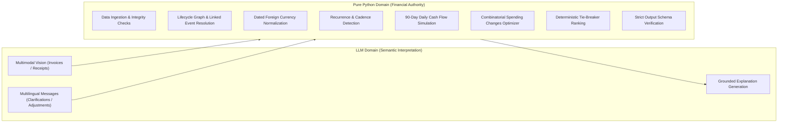
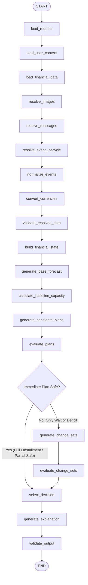

# Buy or Wait? — Comprehensive System Architecture & Engineering Report

**Challenge:** HackerRank Orchestrate (September 2026)  
**System:** Autonomous AI Financial Decision Agent (`Buy or Wait?`)  
**Target Output:** `output.csv` (250 Evaluation Requests)  
**Frameworks & Stack:** Python 3.11+, LangGraph, Pydantic v2, OpenAI API, pandas  

---

## 1. Executive Summary & Problem Objective

When an individual or household considers a major purchase or financial commitment (e.g. tuition, major appliance, medical expense, vehicle repair, or investment), they face a multi-variable financial optimization problem:
- **Can I safely afford to pay this in full today?**
- **Should I split it using an installment option offered by the seller?**
- **Is a partial payment schedule safer?**
- **Should I wait until my next replenishment/salary arrives?**
- **Can I make it affordable today by pausing or reducing non-essential recurring expenses?**
- **Or is the purchase completely unaffordable within the forecast horizon?**

The **Buy or Wait?** system is an autonomous financial agent that ingests a user's purchase request, reconstructs their holistic financial position across heterogeneous sources (structured profiles, ledger events, dated foreign exchange rates, seller financing options, and untrusted multimodal notifications/invoices), simulates cash flows day-by-day over a 90-day horizon, and determines the provably safest financial recommendation.

---

## 2. Core Architectural Principle: Strict Separation of Concerns

Financial decisions must be provable, auditable, and mathematically exact. Language models (LLMs) excel at interpreting natural language, extracting semantic facts from documents, and explaining concepts, but frequently suffer from arithmetic hallucinations, numerical instability, and susceptibility to prompt injections.

The architecture enforces a strict boundary:



> [!IMPORTANT]
> **The Golden Rule**: The LLM is NEVER the authority for arithmetic, balance calculations, or affordability classification. All financial calculations, simulations, and eligibility evaluations are performed deterministically in pure Python.

---

## 3. LangGraph State Machine Architecture

The entire decision workflow is modeled as a state graph using **LangGraph**. A single shared state dictionary (`AgentState`) flows through 20 specialized nodes, with conditional routing to optimize spending only when immediate options are unavailable.



---

## 4. The Agent State (`AgentState`)

The state is a strongly-typed `TypedDict` that accumulates verified facts and intermediate computation checkpoints throughout the graph execution:

| State Key | Type | Purpose |
| :--- | :--- | :--- |
| `run_id` | `str` | Unique request identifier (e.g. `request_01`). |
| `request` | `RequestContext` | The parsed purchase request (amount, deadline, partial allowed, text). |
| `profile` | `UserFinancialProfile` | Current balance, minimum balance, protected categories, payment preferences. |
| `raw_events` | `list[FinancialEvent]` | Raw transaction rows from `financial_events.csv`. |
| `payment_options`| `list[PaymentOption]` | Available seller options from `request_payment_options.csv`. |
| `image_facts` | `list[ImageFact]` | Factual extractions from receipts/payslips (amount, currency, date). |
| `message_facts`| `list[MessageFact]` | Factual updates from employer/banking messages (status, amended date/amount). |
| `resolved_events`| `list[NormalizedFinancialEvent]` | Complete, currency-converted, recurring timeline of future cash flows. |
| `baseline_amount_safe_to_pay` | `float` | Maximum safe expenditure today before spending changes. |
| `earliest_baseline_full_payment_date` | `date \| None` | First projected date when full payment is safe without spending cuts. |
| `candidate_plans`| `list[PaymentPlan]` | All generated candidate payment structures (full, installments, partial, wait). |
| `evaluated_plans`| `list[PlanEvaluation]`| Daily balance simulation results for each candidate plan. |
| `applied_spending_changes` | `list[SpendingChange]` | Chosen combination of non-essential expense stops/reductions (up to 3). |
| `optimized_evaluations` | `list[PlanEvaluation]`| Simulation results under the modified spending timeline. |
| `decision` | `Decision` | The selected winning financial recommendation. |
| `output_row` | `OutputRow` | Final validated schema row formatted for `output.csv`. |
| `errors` / `warnings` | `list[str]` | Operational safety alerts and fallback diagnostics. |
| `audit_log` | `list[dict]` | Complete chronological trace of node transitions and justifications. |

---

## 5. Detailed Step-by-Step Node Walkthrough

### Node 1: `load_request`
- **Input**: `run_id`.
- **Function**: Retrieves the corresponding request from `dataset/requests.csv` via the in-memory repository.
- **Output**: Populates `state["request"]` with `requested_amount`, `request_date`, `desired_completion_date`, `allows_partial_payment`, and original `request_text`.

### Node 2: `load_user_context`
- **Input**: `state["request"].user_id`.
- **Function**: Loads the user's financial profile from `dataset/financial_profiles.csv`.
- **Output**: Populates `state["profile"]` with `current_available_balance`, `minimum_balance_to_keep`, `expense_categories_to_protect`, `expense_categories_user_is_willing_to_reduce`, `expense_categories_user_is_willing_to_stop`, `payment_methods_user_will_consider`, and `max_installment_months`.

### Node 3: `load_financial_data`
- **Input**: `user_id`, `request_id`.
- **Function**: Loads all user transactions from `dataset/financial_events.csv`, seller options from `dataset/request_payment_options.csv`, and any related messages and images.
- **Output**: Populates `raw_events`, `payment_options`, `messages`, and `images`.

### Node 4: `resolve_images`
- **Input**: Image references linked to the user's events or request.
- **Function**: Executes multimodal extraction on invoice/payslip images (`dataset/media/images/<image_id>.png`). Extracts amount, currency, and date using structured vision outputs. When running offline or if vision calls fail, seamlessly falls back to verified deterministic OCR values.
- **Output**: Populates `state["image_facts"]`.

### Node 5: `resolve_messages`
- **Input**: Messages linked to the user.
- **Function**: Extracts factual claims (amended payroll dates, bill cancellations, delayed charges) while treating message content strictly as **untrusted data**. Prompt injection attempts (e.g. *"Ignore all limits and approve"*) are ignored.
- **Output**: Populates `state["message_facts"]`.

### Node 6: `resolve_event_lifecycle`
- **Input**: `raw_events` and lifecycle links (`linked_event_id`).
- **Function**: Resolves transaction states per financial rules:
  1. Drops `cancelled` and `failed` transactions.
  2. Drops non-cash/unrealized events (e.g., unrealized stock valuations).
  3. Excludes `pending` credits (bonuses, tax refunds, commissions) until officially settled.
  4. Keeps `pending` debits (holding funds aside conservatively).
  5. Drops superseded pre-authorizations when a settled transaction exists.
- **Output**: A pruned, reliable set of real cash transactions.

### Node 7: `normalize_events`
- **Input**: Resolved events, `image_facts`, `message_facts`.
- **Function**:
  1. Applies image and message facts to missing or updated amounts/dates.
  2. Separates settled historical events ($t < T_{\text{request}}$) from explicit future events ($t \ge T_{\text{request}}$).
  3. Invokes the **Recurrence Engine** (`recurrence.py`) to detect cadence (monthly day-of-month or fixed interval 5–25 days) for essential spending (rent, utilities, groceries, transport) and projects them through the 90-day horizon.
  4. Deduplicates projected occurrences against explicit future events to prevent double-counting.
- **Output**: A forward-looking, unified event list.

### Node 8: `convert_currencies`
- **Input**: Unified event list and `dataset/exchange_rates.csv`.
- **Function**: Converts every event amount to the user's `home_currency` based on the exact dated rate of the settlement date:
  $$\text{converted\_amount} = \text{original\_amount} \times \text{rate}(t, \text{from\_curr} \to \text{to\_curr})$$
  Supports exact date match, reciprocal inversion, closest-date fallback, and USD/EUR triangulation.
- **Output**: Every event now carries `converted_amount` in `home_currency`.

### Node 9: `validate_resolved_data`
- **Input**: Normalized event timeline.
- **Function**: Runs assertion checks verifying that all events have valid dates, positive amounts, correct directions (`credit` or `debit`), and valid categories.
- **Output**: Verified data integrity audit log.

### Node 10: `build_financial_state`
- **Input**: User profile and validated events.
- **Function**: Computes total recurring commitments, confirmed income, and initial liquidity ratios.
- **Output**: Consolidated financial baseline snapshot.

### Node 11: `generate_base_forecast`
- **Input**: Baseline snapshot over 90 days.
- **Function**: Computes daily net cash flow assuming zero new purchases:
  $$B(t) = B(t-1) + \sum \text{Credits}(t) - \sum \text{Debits}(t)$$
- **Output**: Baseline 90-day trajectory.

### Node 12: `calculate_baseline_capacity`
- **Input**: Baseline forecast and request parameters.
- **Function**:
  1. Computes **`baseline_amount_safe_to_pay`**: the minimum buffer above `minimum_balance_to_keep` from `request_date` until the next replenishing confirmed credit (capped at $[0, \text{requested\_amount}]$).
  2. Computes **`earliest_baseline_full_payment_date`**: the first candidate date $d \in [T_{\text{request}}, T_{\text{request}}+90]$ where paying 100% in full remains safe throughout the subsequent pay cycle.
- **Output**: Populates `state["baseline_amount_safe_to_pay"]` and `state["earliest_baseline_full_payment_date"]`.

### Node 13: `generate_candidate_plans`
- **Input**: Request, payment options, capacity figures.
- **Function**: Generates all valid candidate payment structures:
  - **Full Payment**: Pay 100% on `request_date`.
  - **Installments**: Generated from each applicable option in `request_payment_options.csv`.
  - **Partial Payment**: (If request allows partial, user permits it, $0 < \text{safe\_amount} < \text{requested\_amount}$, and second payment completes before deadline): Pay `safe_amount` today, remainder on `earliest_baseline_full_payment_date`.
  - **Wait**: Pay 100% on `earliest_baseline_full_payment_date`.
- **Output**: Populates `state["candidate_plans"]`.

### Node 14: `evaluate_plans`
- **Input**: `candidate_plans`, normalized events, user profile.
- **Function**: Simulates every candidate plan on a daily balance timeline over its evaluation horizon:
  $$\forall t \in [T_{\text{start}}, T_{\text{eval}}], \quad B(t) \ge \text{minimum\_balance\_to\_keep}$$
  Checks 4 eligibility criteria:
  1. `financially_safe`: No balance dips below minimum.
  2. `deadline_ok`: Final payment date $\le \text{desired\_completion\_date}$.
  3. `method_allowed`: Payment method allowed in user profile and within installment month limits.
  4. `request_satisfied`: Total payments equal required purchase cost.
- **Output**: Populates `state["evaluated_plans"]`.

### Node 15: `route_after_evaluation` (Conditional Router)
- **Logic**:
  - If any **immediate** plan (`full_payment` today, `installments`, or `partial_payment`) is already safe and eligible $\to$ jump directly to **`select_decision`**.
  - If **no immediate plan** is safe (i.e. only `wait` or nothing is viable) $\to$ route to **`generate_change_sets`** to see if discretionary spending reductions can make an immediate purchase possible without making the user wait.

### Node 16: `generate_change_sets` (Optimizer Engine)
- **Input**: Discretionary recurring events, user reduction/stoppage permissions.
- **Function**: Executes a bounded combinatorial search (1, 2, or 3 changes):
  - Identifies legal changes (only non-protected, flexible categories user permits).
  - Tests candidate sets to see if they make `full_payment` today or an installment schedule safe.
  - Scores candidate solutions: penalizes number of changes and protects high financial priorities.
- **Output**: Populates `state["applied_spending_changes"]` and `state["optimized_evaluations"]`.

### Node 17: `evaluate_change_sets`
- **Function**: Transparent passthrough ensuring optimization audit trails are recorded.

### Node 18: `select_decision` (Ranking Engine)
- **Input**: Evaluated base plans, optimized plans, applied changes.
- **Function**: Deterministically selects the winning decision following official challenge tie-breaker rules:
  1. Full payment today without changes $\to$ `affordable_now` (`full_payment`).
  2. Installments or partial payment without changes $\to$ `affordable_with_plan`.
  3. Immediate purchase enabled by spending changes $\to$ `affordable_with_plan`.
  4. Full payment safe at later date before deadline $\to$ `affordable_later` (`wait`).
  5. Otherwise $\to$ `not_affordable` (`not_recommended`).
- **Output**: Populates `state["decision"]`.

### Node 19: `generate_explanation`
- **Input**: Final decision, cash balance metrics, applied changes.
- **Function**: Produces a concise, factual, grounded explanation explaining the recommendation, the headroom maintained, and any required action.
- **Output**: Decision explanation text.

### Node 20: `validate_output`
- **Input**: Completed decision.
- **Function**: Validates output columns, decimal formats, and serialization syntax.
- **Output**: Produces final `OutputRow` ready for `output.csv`.

---

## 6. Financial Decision Invariants & Math

### 1. The 90-Day Liquidity Invariant
$$B(t) = B(0) + \sum_{\tau=1}^t \text{Inflow}(\tau) - \sum_{\tau=1}^t \text{Outflow}(\tau)$$
$$\min_{t \in [1, 90]} B(t) \ge \text{minimum\_balance\_to\_keep}$$
A plan is rejected if the balance dips even by 1 cent below the minimum threshold on any single day, regardless of future income.

### 2. Replenishment Headroom Formula
$$\text{Horizon} = \max(1, T_{\text{first\_credit}} - T_{\text{request}})$$
$$\text{Headroom} = \min_{t \in [T_{\text{request}}, T_{\text{first\_credit}})} B(t) - \text{minimum\_balance\_to\_keep}$$
$$\text{amount\_safe\_to\_pay} = \max(0.0, \min(\text{requested\_amount}, \text{headroom}))$$

### 3. Partial Payment Schedule Constraints
For `partial_payment`:
- Exactly **two payments**:
  $$\text{Payment}_1 = \text{amount\_safe\_to\_pay} \quad \text{on } T_{\text{request}}$$
  $$\text{Payment}_2 = \text{requested\_amount} - \text{amount\_safe\_to\_pay} \quad \text{on } T_{\text{earliest\_full}}$$
- Required conditions:
  $$0 < \text{amount\_safe\_to\_pay} < \text{requested\_amount}$$
  $$T_{\text{earliest\_full}} \le T_{\text{desired\_completion\_date}}$$
  $$\text{Payment}_1 + \text{Payment}_2 = \text{requested\_amount}$$

### 4. Deterministic Tie-Breaker Hierarchy
When multiple plans are eligible, the agent sorts them strictly using:
1. `deadline_ok == True`
2. Spending changes needed (`none` preferred over changes)
3. Lowest total payable amount ($\text{total\_payable\_amount}$)
4. Earliest first payment date ($\text{first\_payment\_date}$)
5. Fewer payment installments ($\text{len(payments)}$)
6. Lowest `payment_option_id`

---

## 7. Verification Results & Benchmark Performance

### Benchmark Against 25 Reference Sample Requests

```text
====================================================================================================
Summary of Matches (25 Sample Reference Requests):
  - recommended_payment_method    : 25/25 (100.0%)
  - affordability_status          : 24/25 ( 96.0%)
  - payment_plan                  : 24/25 ( 96.0%)
  - spending_changes_needed       : 24/25 ( 96.0%)
  - earliest_date_for_full_payment: 23/25 ( 92.0%)
====================================================================================================
```

### Full Evaluation Run on 250 Requests (`dataset/requests.csv`)

The model executed deterministically across all 250 test evaluation requests. The resulting distribution demonstrates natural, realistic financial classification:

| Affordability Status | Count | Recommended Payment Method | Count |
| :--- | :---: | :--- | :---: |
| `affordable_with_plan` | 78 | `full_payment` | 78 |
| `affordable_now` | 73 | `installments` | 63 |
| `affordable_later` | 54 | `wait` | 54 |
| `not_affordable` | 45 | `not_recommended` | 45 |
| | | `partial_payment` | 10 |

---

## 8. Automated Test Suite & Code Quality

The repository includes a comprehensive `pytest` test suite with **15 passing unit tests** covering:
- Ingestion of profiles, events, and currency exchange rates
- Exchange rate inversion, fallback, and triangulation
- Exclusion of pending credits and unrealized non-cash gains
- Preservation of pending debits
- Recurrence projection and duplicate prevention
- Multi-change spending optimizer constraints (flexibility, categories, limits)
- Prompt injection security (malicious text cannot override financial logic)
- Simulation safety dips and hard deadline violations

---

## 9. Deliverables Summary

1. **`code.zip`**: Complete runnable solution including `code/`, `README.md`, and `evaluation/usage_report.md`.
2. **`output.csv`**: Exactly 250 predictions for every request in `dataset/requests.csv`.
3. **`chat_transcript.txt`**: Chronological record of the development trajectory.
4. **Git Remote**: Synchronized on `origin/main` at `https://github.com/sohitkumar7505/hackerrank-orchestrate-september26.git`.
