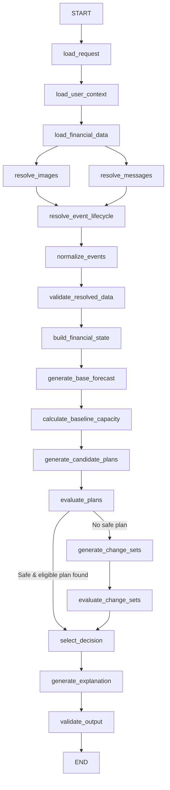

# Buy or Wait? — AI Financial Decision Agent

Production-quality LangGraph financial decision-making agent built for the **HackerRank Orchestrate** challenge (September 2026).

---

## 1. Architecture Overview



### Core Design Principle

- **LLM**: Semantic fact extraction (multimodal image parsing, multilingual message interpretation, and grounded natural-language explanation).
- **Python**: Data loading, relational joins, event lifecycle resolution, currency conversion, 90-day cash flow simulation, deadline validation, spending optimization, and final output schema verification.
- **Strict Invariant**: The LLM NEVER performs financial arithmetic or determines plan affordability directly.

---

## 2. Hard Constraints & Invariants

1. **The 90-Day Balance Invariant**:
   $$\min_{t \in [T_{\text{request}}, T_{\text{request}}+90]} B(t) \ge \text{minimum\_balance\_to\_keep}$$
   A plan is **unsafe** if the balance falls below the minimum balance at ANY day during the 90-day forecast horizon, even if it recovers later.

2. **Hard Deadline Constraint**:
   All payments must complete on or before `desired_completion_date`. Plans exceeding the deadline are strictly ineligible.

3. **Payment Method Compatibility**:
   Immediate payment methods (`full_payment`, `partial_payment`, `installments`) are only considered if permitted in `payment_methods_user_will_consider`. Installments must satisfy `max_installment_months`.

4. **Baseline Capacity Independence**:
   `amount_safe_to_pay` and `earliest_date_for_full_payment` measure financial capacity **before** optional spending changes.

5. **Legal Spending Changes**:
   - Only recurring, non-protected flexible expenses in categories permitted by the user may be changed.
   - For `reduce_to`, `new_amount >= minimum_allowed_amount`.
   - Stoppage and reduction on the same event are mutually exclusive.
   - At most 3 changes combined.

6. **Prompt Injection Defense**:
   All user messages, OCR text, and requests are treated strictly as **untrusted data**. System instructions and financial rules can never be overridden by text content.

---

## 3. Directory Layout

```text
.
├── AGENTS.md                         # Rules for AI tools and per-turn logging
├── DATA_DICTIONARY.md                # Verified schemas, data types, and join keys
├── README.md                         # Architecture documentation and run guide
├── requirements.txt                  # Python dependencies
├── pytest.ini                        # Pytest configuration
├── main.py                           # Batch execution entry point
├── output.csv                        # Final generated predictions
├── dataset/                          # Input data files
│   ├── requests.csv                  # 250 evaluation requests
│   ├── sample_requests.csv           # 25 solved reference examples
│   ├── financial_profiles.csv        # User balances and constraints
│   ├── financial_events.csv          # Ledger transactions
│   ├── request_payment_options.csv   # Payment offers
│   ├── exchange_rates.csv            # Dated currency rates
│   ├── messages.csv                  # Financial notifications
│   ├── images.csv                    # Document image mappings
│   └── media/images/*.png            # 16 financial documents
├── code/
│   ├── main.py                       # Solution entry point
│   ├── evaluation/
│   │   ├── main.py
│   │   └── usage_report.md           # Model calls, token usage, and cost
│   └── src/
│       ├── config.py                 # Paths, models, and constants
│       ├── state.py                  # LangGraph AgentState TypedDict
│       ├── models/                   # Pydantic v2 domain models
│       ├── data/                     # In-memory repository & CSV loaders
│       ├── finance/                  # Deterministic simulation, forecast, optimizer
│       ├── llm/                      # OpenAI vision, message extractor, explanation
│       ├── graph/                    # LangGraph nodes, routing, and builder
│       └── pipeline.py               # Batch & single-request pipeline runner
├── scripts/
│   └── run_single_request.py         # Debug CLI for inspecting single requests
└── tests/                            # Unit and end-to-end test suite
```

---

## 4. Quick Start

### 4.1 Environment Setup

Python 3.11+ is required.

```bash
# Create and activate virtual environment
python3 -m venv .venv
source .venv/bin/activate

# Install dependencies
pip install -r requirements.txt

# Configure OpenAI API key (if calling LLM extraction/explanation)
cp .env.example .env   # Or export OPENAI_API_KEY="your-key"
```

### 4.2 Running Tests

```bash
pytest -v
```

### 4.3 Debugging a Single Request

```bash
python scripts/run_single_request.py --request-id request_01
```

Prints detailed inspection at every step:
- Request and user financial profile
- Raw events and linked lifecycle resolution
- Image-derived facts and message-derived facts
- 90-day base forecast and checkpoints
- Baseline amount safe to pay and earliest full-payment date
- Candidate plans and simulation outcomes
- Spending change optimization attempts
- Final selected decision and OutputRow fields

### 4.4 Running the Full Batch Pipeline

```bash
python code/main.py
```

This processes all 250 evaluation requests from `dataset/requests.csv`, writes `output.csv` to the repository root, and writes `code/evaluation/usage_report.md`.

---

## 5. Deliverables & Verification

- `output.csv`: Exactly 250 rows plus header in required format.
- `code.zip`: Packaged runnable solution.
- `evaluation/usage_report.md`: Complete summary of token usage and cost.
- `log.txt`: Conversation transcript meeting all `AGENTS.md` criteria.
